# Demigod Tools

[](https://github.com/pantheon-systems/terminus-plugin-example/tree/3.x)



A simple plugin for Terminus-CLI version 3.0 or newer that adds a docker compose and environment variables.


## Requirements

* Terminus version 3.0

  `brew install pantheon-systems/external/terminus`

* [direnv](https://direnv.net) and [Pipe Viewer/pv](http://www.ivarch.com/programs/pv.shtml)

  `brew install direnv pv mysql-client`

   Also, be sure to integrate DIRENV into your shell using the information here: https://direnv.net/docs/hook.html

* Docker version 4.0+ ( docker-compose is now a part of default install )

  `brew install --cask docker`

* [Robo](https://github.com/consolidation/robo)

  See the Readme on the robo repository

* [php](https://php.net)

  Version 7.4+

## Installation

To install this plugin using Terminus 3:

```
terminus self:plugin:install demigod-tools/demigod-tools
```

## Configuration

These commands require no configuration

## Usage

```
# clone the site locally with terminus 3
terminus local:clone {site_name}

# Copy the demigod docker templates into place
terminus demigod:copy-templates {SITE_NAME}

# leaving you in the site directory
>$HOME/pantheon-local-copies/{SITE_NAME}

# use robo to launch the containers
robo docker:up

```

## Update

`terminus self:plugin:update`
