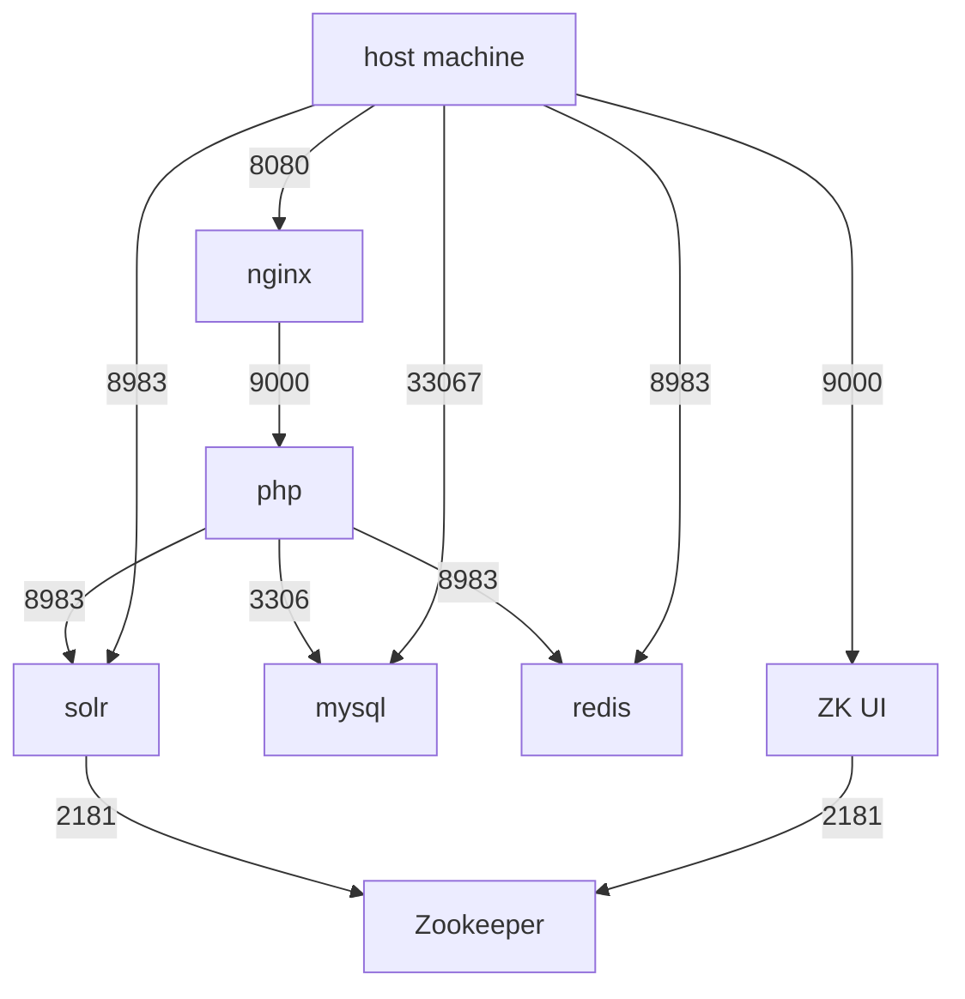

```mermaid
graph TD
  HOST[ host machine ] --> | 8080 | NGINX[ nginx ]
  NGINX --> | 9000 | PHP[ php ]
  PHP --> | 8983 | SOLR[ solr ]
  PHP --> | 3306 | MYSQL[ mysql ]
  PHP --> | 8983 | REDIS[ redis ]
  SOLR --> | 2181 | ZK[ Zookeeper ]
  ZKUI[ ZK UI ] --> | 2181 | ZK
  HOST --> | 9000 | ZKUI
  HOST --> | 33067 | MYSQL
  HOST --> | 8983 | SOLR
  HOST --> | 8983 | REDIS
```
